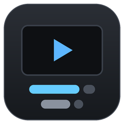
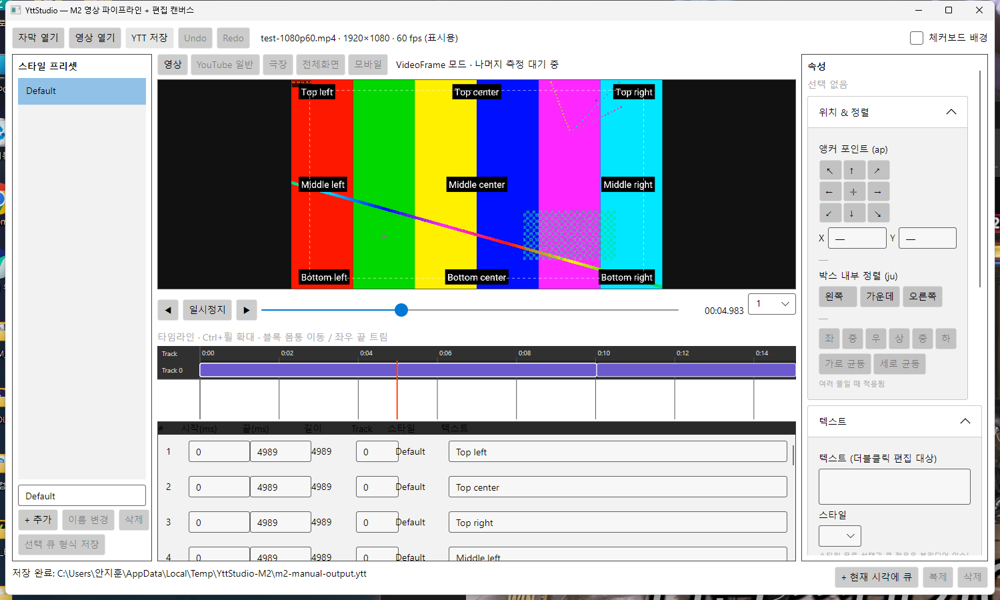

<div align="center">



# yttStudio

**YouTube YTT (SRV3) 字幕専用の WYSIWYG エディタ**

映像の上で直接配置・装飾して `.ytt` を書き出すデスクトップアプリ


[](https://app.codacy.com/gh/DO0OG/yttStudio/dashboard?utm_source=gh&utm_medium=referral&utm_content=&utm_campaign=Badge_grade)

[한국어](README.md) · [English](README.en.md) · **日本語**

</div>

---

YouTube 標準の字幕エディタには装飾機能がありません。しかしプレイヤー自体は
**YTT (YouTube Timed Text、内部名称 SRV3)** という XML 形式を通じて、色・縁取り・グロー・
位置指定・カラオケタイミング・ルビ・縦書きに対応しています。既存のエコシステムには
**コンバータ**はあっても、**映像の上で直接配置できるエディタ**がありませんでした。
yttStudio はその空白を埋めます。

<div align="center">

</div>

<div align="center"><sub>
プレビュー上で字幕をその場で編集します。左はスタイルプリセット、右はプロパティ
パネル、下はトラックタイムラインと字幕一覧です。
</sub></div>

## 主な機能

| | |
|---|---|
| **映像上での編集** | 再生しながら字幕をドラッグ・複数選択・スナップ整列し、その場でテキストを直します |
| **YouTube アドレスで開く** | アドレスを貼るだけでダウンロードせずストリーミングでプレビューします |
| **タイムライン** | 拡大・左右パン、ブロック移動と端のトリム。パネル幅は境界をドラッグして調整 |
| **形式ルールの強制** | 座標変換・フォント倍率の圧縮・不透明度の上限など YTT の制約をコードで検査 |
| **カラオケ** | 音節の自動分割 (ハングル・かな・ラテン・漢字)、再生中のタップ入力、5 種類の進行方式 |
| **エフェクト** | 移動・フェード・揺れ・色収差・アニメーション。揺れは決定的なので巻き戻しても同じ結果 |
| **検証** | YouTube の制約 17 ルールの検査と、取り消せる自動修正 |
| **相互変換** | `.ytt` / `.srv3` / `.ass` の読み込みと書き出し。欠落は警告で明示 |
| **プロジェクト** | `.yttproj` パッケージ、間隔を選べる自動保存、異常終了からの復旧 |
| **ビューポートモード** | 通常・シアター・全画面・モバイル。YouTube プレイヤーの実測値に基づきます |
| **環境設定** | 言語・テーマ・libmpv パス・自動保存をウィンドウで設定し、次回起動まで保持します |
| **3 言語** | 한국어 · English · 日本語 をリアルタイムで切り替え |

`Space` で再生と一時停止を切り替えます。`.ytt` / `.srv3` / `.ass` 字幕と
`.mp4` / `.mkv` / `.webm` / `.mov` / `.avi` / `.m4v` 映像をウィンドウにドロップして開けます。

操作方法の全体は[ユーザーガイド](docs/USER_GUIDE.md)にあります。

## 最近の変更

| | |
|---|---|
| **v0.2.5 YouTube 再生エラー修正** | YouTube アドレスの再生準備中に Deno のインストールファイルがロックされ、常に失敗していた問題を修正しました。`--js-runtimes` に対応しない古い yt-dlp は公式の固定資産に自動で置き換えます |
| **v0.2.4 YouTube 再生ホットフィックス** | 現在の yt-dlp が YouTube の JavaScript challenge を処理するために必要な Deno 2.3+ を利用します。互換 Deno がない場合は公式 Deno v2.9.6 資産を検証してユーザー領域へ自動導入し、yt-dlp の事前確認と libmpv 再生の両方で利用します |
| **アクセス拒否の分類を修正** | HTTP 403・429・bot challenge を通常のネットワーク切断として誤表示しないようにしました |
| **v0.2.3 映像ランタイムを標準化** | libmpv がない場合は最初に映像を開くときに検証済み LGPL ランタイムをアプリ内で導入します。YouTube URL を初めて開く際に yt-dlp がなければ、公式配布物を検証して導入します |
| **再生ショートカットの整理** | ウィンドウのどこにフォーカスがあっても `Space` が再生・一時停止として働きます。コマ送りボタンは `⏮` `⏭` に変えました |
| **ビューポートモード** | YouTube プレイヤーを実測し、通常・シアター・全画面・モバイルの比率を再現します |

## はじめに

[最新リリース](https://github.com/DO0OG/yttStudio/releases/latest)からダウンロードしてください。
.NET ランタイムを同梱しているため、別途インストールは不要です。

| プラットフォーム | ファイル | インストール方法 |
|---|---|---|
| Windows | `yttStudio-v*-win-x64-setup.exe` | 実行するとスタートメニュー登録・アンインストーラ・ファイル関連付けまで処理します |
| Windows (インストール不要) | `yttStudio-v*-win-x64.zip` | 展開して `YttStudio.App.exe` を実行 |
| macOS (Apple Silicon) | `yttStudio-v*-osx-arm64.dmg` | 開いて `yttStudio.app` を `Applications` にドラッグ |
| Linux | `yttStudio-v*-linux-x86_64.AppImage` | `chmod +x` して実行 |

> **コード署名のない配布物です。** 証明書がないため初回起動時に警告が出ます。
> Windows は SmartScreen の警告で**詳細情報 → 実行**、macOS は `yttStudio.app` を
> 右クリックして**開く**を選んでください。

### 映像再生ランタイム

映像再生は基本機能です。対応プラットフォームでは事前の手動インストールは不要です。

| 項目 | v0.2.5 の動作 |
|---|---|
| libmpv 2.0 以上 | ローカル映像と YouTube 再生に必要です。指定済み・検出可能な互換ライブラリを優先し、見つからない場合は最初に映像を開くとき、対応プラットフォーム向けの**検証済み LGPL ランタイム**をユーザー領域へ自動導入します |
| yt-dlp | YouTube URL の解析に必要です。`--js-runtimes` に対応する既存のインストールを優先し、見つからないか非対応の場合は公式 `yt-dlp/yt-dlp 2026.08.19` 資産を取得して SHA-256 を検証後、ユーザー領域へ導入します |
| Deno 2.3 以上 | 現在の yt-dlp が YouTube の JavaScript challenge を解決するために必要です。互換インストールが見つからない場合は公式 `denoland/deno v2.9.6` 資産を取得し、サイズと SHA-256 を検証してユーザー領域へ導入します |

アプリ内 libmpv の現在の取得元は Windows x64 では `zhongfly/mpv-winbuild` の明示的な LGPL ビルド、macOS arm64/Linux x64 では検証済みの `Shusek/KMediaMpv` ランタイムです。yt-dlp と Deno もそれぞれ公式 upstream のリリース資産だけを利用します。これらの外部ランタイムは yttStudio の ZIP・インストーラ・DMG・AppImage には直接同梱しません。**ツール → 設定 → 映像**から libmpv の再インストールや任意パスの指定もできます。固定バージョン・ハッシュ・ライセンス境界は[依存関係](docs/DEPENDENCIES.md)と[サードパーティ告知](docs/THIRD-PARTY-NOTICES.md)を参照してください。

### ソースからのビルド

.NET 10 SDK が必要です。

```bash
git clone --recursive https://github.com/DO0OG/yttStudio.git
cd yttStudio
dotnet build -c Release
dotnet run --project src/YttStudio.App
```

字幕ファイルを引数に渡すとそのまま開きます。

```bash
dotnet run --project src/YttStudio.App -- samples/showcase.ass
```

## 知っておくとよいこと

- **プレビューは編集用の近似です。** YouTube の実際のレンダラは DOM/CSS ベースのため、
  グローの半径や改行位置がわずかに異なります。最終確認は実際のアップロードで
  行ってください。
- **作業ファイルは `.yttproj` で保存してください。** `.ytt` はエフェクトがキーフレームに
  展開された結果なので、読み戻してもエフェクトには復元されません。
- **回転と自由なスケールハンドルがないのは意図した設計です。** YTT 形式に回転も任意の
  ボックススケールもありません。リサイズハンドルはドラッグを `SizePercent` の
  フォント倍率に変換します。
- **全画面とモバイル縦のビューポートはまだ実測できていません。** 通常モードの比例式を
  そのまま使っています。測定記録は[ビューポートモード](docs/viewport-modes.md)にあります。

## ドキュメント

| ドキュメント | 内容 |
|---|---|
| [ユーザーガイド](docs/USER_GUIDE.md) | 機能ごとの使い方と制約 |
| [依存関係](docs/DEPENDENCIES.md) | 固定バージョン、配布方針、ローカルパッチ |
| [性能](docs/PERFORMANCE.md) | 解像度ごとの実測値とバックエンド選定の根拠 |
| [形式の検証記録](docs/YTT-VERIFICATION.md) | YTT ルールの根拠と確度の等級 |
| [手動 QA](docs/MANUAL_QA.md) | 自動化できない検証項目 |
| [サードパーティ告知](docs/THIRD-PARTY-NOTICES.md) | 同梱フォントとライブラリ |

## 技術スタック

.NET 10 · C# 14 · Avalonia 12 · SkiaSharp · libmpv · xUnit

字幕形式の入出力は [YTSubConverter](https://github.com/arcusmaximus/YTSubConverter) (MIT)
を使用しています。`ap` と `ju` を独立して扱うためのローカルパッチが 1 つ当たっています。

## ライセンス

[LICENSE](LICENSE) を参照してください。同梱フォントと外部ライブラリの告知は
[サードパーティ告知](docs/THIRD-PARTY-NOTICES.md)にあります。

## 商標および非提携の告知

yttStudio は独立したオープンソースプロジェクトであり、YouTube または Google LLC と
提携しておらず、その承認や後援を受けた公式製品でもありません。YouTube は Google LLC の商標です。

## 貢献者

- [DO0OG](https://github.com/DO0OG)
