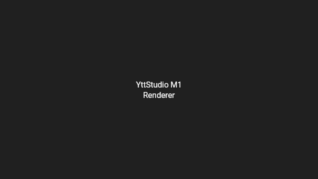
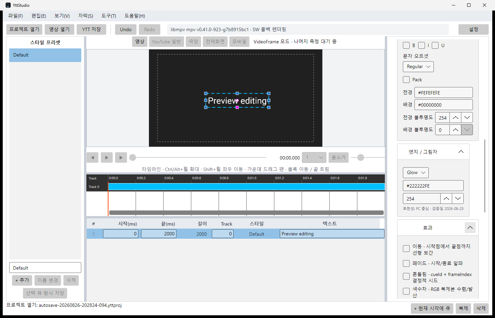

<div align="center">


# YttStudio

**유튜브 YTT(SRV3) 자막 전용 WYSIWYG 에디터**

영상 위에서 직접 배치하고 스타일링해 `.ytt` 를 바로 뽑는 데스크톱 앱


**한국어** · [English](README.en.md) · [日本語](README.ja.md)

</div>

---

## 왜 만들었나

유튜브 자막 편집기는 스타일링을 지원하지 않습니다. 하지만 플레이어 자체는
**YTT(YouTube Timed Text, 내부 명칭 SRV3)** 라는 XML 포맷으로 색상·외곽선·글로우·
위치 지정·가라오케 타이밍·루비·세로쓰기를 이미 지원합니다. MV나 커버곡에서 보이는
"화려한 자막"이 이 포맷으로 만들어진 것입니다.

기존 생태계에는 **변환기**는 있어도 **영상 위에서 직접 배치하는 편집기가 없었습니다.**
YttStudio 는 그 자리를 채웁니다.

## 화면

<div align="center">

</div>

<div align="center"><sub>
영상 위에 자막을 합성해 마우스로 배치합니다. 왼쪽은 스타일 프리셋, 오른쪽은 속성 패널,
아래는 트랙 타임라인과 자막 목록입니다.
</sub></div>

<br />

<table>
<tr>
<td width="50%"></td>
<td width="50%"></td>
</tr>
<tr>
<td align="center"><sub>YTT 규칙을 적용한 자막 렌더링</sub></td>
<td align="center"><sub>이동·페이드·흔들림·색수차 효과</sub></td>
</tr>
</table>

## 주요 기능

| | |
|---|---|
| **영상 위 편집** | libmpv 로 재생하면서 자막을 드래그·다중 선택·스냅 정렬 |
| **재생과 파일 드롭** | 영상을 연 뒤 `Space`로 재생·일시정지를 전환하고, 창에 지원되는 자막·영상 파일을 드롭해 바로 엽니다 |
| **타임라인** | 확대·좌우 팬·스크롤바 드래그, 블록 이동과 끝 트림. 패널 크기는 경계를 끌어 조절 |
| **포맷 규칙 강제** | 좌표 변환, 폰트 배율 압축, 불투명도 상한 등 YTT 제약을 코드에서 검사 |
| **가라오케** | 음절 자동 분할(한글·가나·라틴·한자), 재생 중 탭 입력, 5가지 진행 방식 |
| **효과** | 이동 · 페이드 · 흔들림 · 색수차 · 애니메이션. 흔들림은 결정적이라 되감아도 같은 결과 |
| **검증기** | 유튜브 제약 17개 규칙 검사와 되돌릴 수 있는 자동 수정 |
| **왕복 변환** | `.ytt` / `.srv3` / `.ass` 가져오기·내보내기, 손실은 경고로 명시 |
| **프로젝트** | `.yttproj` 패키지, 자동 저장(간격 조절 가능), 비정상 종료 복구 |
| **환경설정** | 언어 · 테마 · libmpv 경로 · 자동 저장을 창에서 설정하고 다음 실행까지 유지 |
| **테마** | 시스템 기본 · 라이트 · 다크. 재시작 없이 즉시 전환 |
| **3개 언어** | 한국어 · English · 日本語 실시간 전환 |

파일 드롭은 `.ytt` / `.srv3` / `.ass` 자막과 `.mp4` / `.mkv` / `.webm` / `.mov` / `.avi` / `.m4v` 영상을 지원합니다. `.yttproj`는 프로젝트 열기로 여세요.

## 시작하기

### 요구 사항

| 항목 | 비고 |
|---|---|
| .NET 10 SDK | 빌드에 필요 |
| libmpv 2.0 이상 | **영상 재생에만 필요.** 없어도 자막 편집·검증·저장은 정상 동작 |

### 빌드와 실행

```bash
git clone --recursive https://github.com/DO0OG/YttStudio.git
cd YttStudio
dotnet build -c Release
dotnet run --project src/YttStudio.App
```

자막 파일을 인자로 넘기면 바로 열립니다.

```bash
dotnet run --project src/YttStudio.App -- samples/showcase.ass
```

### libmpv 지정

가장 쉬운 방법은 **도구 → 설정 → 영상** 탭입니다. 경로를 직접 고르거나, Windows 에서는
내려받아 설치할 수 있습니다. 설정한 경로는 다음 실행에도 유지됩니다.

환경 변수로도 지정할 수 있습니다. 탐색 순서는
설정에 저장된 경로 → `YTTSTUDIO_MPV_PATH` → 실행 디렉터리 → OS 표준 경로입니다.

```bash
# Windows
set YTTSTUDIO_MPV_PATH=C:\path\to\libmpv-2.dll

# macOS / Linux
export YTTSTUDIO_MPV_PATH=/usr/lib/libmpv.so.2
```

2.0 미만 버전은 거부하며, 찾지 못하면 영상 기능만 끄고 단색·체커보드 배경으로 폴백합니다.

> **라이선스 안내.** 공식 Windows mpv 빌드는 GPLv2+ 입니다. 그래서 YttStudio 는
> libmpv 바이너리를 배포물에 포함하지 않습니다. 설정 창의 자동 설치는 사용자가
> 출처와 라이선스를 확인하고 직접 버튼을 눌렀을 때만 내려받아 사용자 컴퓨터에 설치합니다.
> macOS 와 Linux 에서는 자동 설치 대신 패키지 매니저 명령을 안내합니다.

## 알아두면 좋은 것

**미리보기는 편집용 근사치입니다.** 유튜브의 실제 자막 렌더러는 브라우저 DOM/CSS 기반이라
글로우 반경이나 줄바꿈 지점이 미세하게 다릅니다. 최종 확인은 실제 업로드로 하세요.

**작업 파일은 `.yttproj` 로 저장하세요.** `.ytt` 는 효과가 키프레임으로 펼쳐진 결과물이라
되읽어도 효과로 복원되지 않고, 트랙과 그리기 순서도 보존되지 않습니다.

**회전·크기 조절 핸들이 없는 것은 의도된 설계입니다.** YTT 포맷에 회전과 자유 스케일이
없기 때문입니다. 넣어두면 화면에서는 변형되는데 결과물에는 반영되지 않아 더 혼란스럽습니다.

**뷰포트 모드(일반·극장·전체화면·모바일)는 비활성 상태입니다.** 각 모드의 실제 좌표 동작을
측정하기 전까지 추측으로 구현하지 않습니다.

## 문서

| 문서 | 내용 |
|---|---|
| [사용자 가이드](docs/USER_GUIDE.md) | 기능별 사용법과 제약 |
| [의존성](docs/DEPENDENCIES.md) | 고정 버전, 배포 전략, 로컬 패치 |
| [성능](docs/PERFORMANCE.md) | 해상도별 실측치와 백엔드 결정 근거 |
| [포맷 검증 기록](docs/YTT-VERIFICATION.md) | YTT 규칙의 근거와 확실성 등급 |
| [수동 QA](docs/MANUAL_QA.md) | 자동화할 수 없는 검증 항목 |
| [제3자 고지](docs/THIRD-PARTY-NOTICES.md) | 포함된 폰트와 라이브러리 |

## 기술 스택

.NET 10 · C# 14 · Avalonia 12 · SkiaSharp · libmpv · xUnit

자막 포맷 입출력은 [YTSubConverter](https://github.com/arcusmaximus/YTSubConverter)(MIT)를 사용합니다.
`ap` 와 `ju` 를 독립적으로 다루기 위한 로컬 패치가 하나 적용되어 있으며,
상세는 [의존성 문서](docs/DEPENDENCIES.md)에 정리되어 있습니다.

## 라이선스

[LICENSE](LICENSE) 를 참조하세요. 번들 폰트와 외부 라이브러리 고지는
[제3자 고지](docs/THIRD-PARTY-NOTICES.md)에 있습니다.

## 기여자

- [DO0OG](https://github.com/DO0OG)
